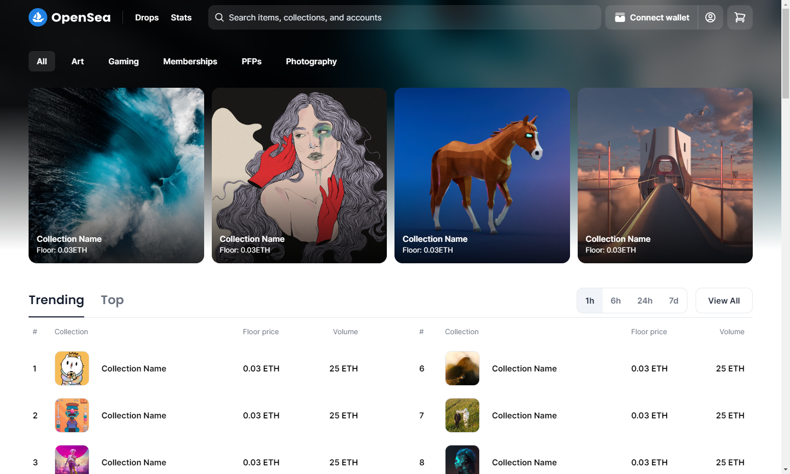

# OpenSea UI Clone



This repository contains a clone of the OpenSea UI home page, built using Vite, React, Tailwind CSS, and Swiper. The clone aims to replicate the user interface of the OpenSea platform's home page.

**Demo:** https://opensea-ui-clone.pages.dev/

## Table of Contents

- [Features](#features)
- [Installation](#installation)
- [Usage](#usage)

## Features

- Responsive design that adapts to various screen sizes.
- Utilizes Vite as the build tool for fast development and hot module replacement.
- Built with React to efficiently manage UI components and state.
- Uses Tailwind CSS for rapid UI styling and customization.
- Implements Swiper for creating interactive and responsive carousels.
- Dialog (Modal) windows will be added soon.

## Installation

To run the OpenSea UI Clone locally, follow these steps:

1. Clone this repository to your local machine using the following command:

```
git clone https://github.com/MrHeyLey/opensea-ui-clone.git
```

2. Navigate to the project directory:

```
cd opensea-ui-clone
```

3. Install the required dependencies using npm, yarn or pnpm:

```
npm install
```

4. Start the development server:

```
npm run dev
```

5. Open your web browser and navigate to http://localhost:5173.

## Usage

The OpenSea UI Clone provides a visual representation of the OpenSea platform's home page. You can explore the design, layout, and UI elements implemented in the clone. However, please note that it does not include the actual functionality of the original OpenSea platform.

Feel free to customize the codebase, add additional functionality, or integrate it with other projects as needed.
